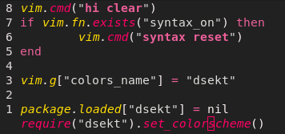

# dsekt.nvim
[Konglig Datasektionen](https://datasektionen.se/)'s official neovim colorscheme, designed by Data's Art Director.



### Installation

Using `lazy`

```
{
    "datasektionen/dsekt.nvim",
    priority = 1000,
}
```

### Credits

Design created by Data's Art Director.

Inspiration for lua setup taken from [doom-one.nvim](https://github.com/NTBBloodbath/doom-one.nvim)
